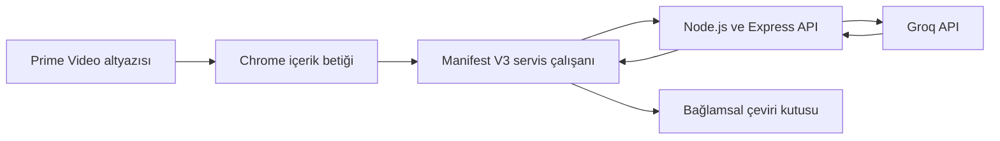

# ZoonLogos

Prime Video'daki İngilizce altyazılarda yer alan kelimelerin, içinde bulundukları cümleye göre Türkçe anlamını gösteren Chrome eklentisi.

ZoonLogos, kullanıcı altyazıdaki bir kelimenin üzerine geldiğinde kelimenin bağlama uygun anlamını, altyazı cümlesinin Türkçe çevirisini ve kısa bir kullanım açıklamasını sunar.

> Proje şu anda Chrome Web Store yayın sürecine hazırlanmaktadır.

## Özellikler

- İngilizce altyazıdaki kelimeyi fareyle algılama
- Kelimenin cümle bağlamına uygun Türkçe anlamını gösterme
- Altyazı cümlesinin tamamını Türkçeye çevirme
- Kelimenin kullanımına ilişkin kısa açıklama sunma
- Prime Video tam ekran görünümünde çalışma
- Popup üzerinden eklentiyi etkinleştirme ve devre dışı bırakma
- Daha önce çevrilen sonuçlar için önbellek kullanma
- Sunucu bağlantı durumunu popup üzerinde gösterme
- Kullanıcı izni ve gizlilik bildirimi

## Nasıl çalışır?

1. İçerik betiği Prime Video sayfasındaki İngilizce altyazıyı algılar.
2. Kullanıcı bir kelimenin üzerine geldiğinde kelime ve içinde bulunduğu cümle alınır.
3. Eklentinin arka plan servis çalışanı isteği HTTPS üzerinden ZoonLogos API'sine gönderir.
4. Node.js ve Express ile geliştirilen API, isteği Groq üzerindeki dil modeline iletir.
5. Bağlamsal kelime anlamı, cümle çevirisi ve kısa açıklama eklentiye geri döner.
6. Sonuç, videonun üzerinde açılan bilgi kutusunda gösterilir.

## Mimari



## Kullanılan teknolojiler

| Teknoloji | Kullanım amacı |
| --- | --- |
| JavaScript | Eklenti ve sunucu uygulama mantığı |
| HTML ve CSS | Popup, çeviri kutusu ve görsel arayüz |
| Chrome Extension Manifest V3 | Chrome eklentisi altyapısı |
| Node.js | Sunucu tarafı JavaScript çalışma ortamı |
| Express | Çeviri ve sağlık kontrolü API uçları |
| Groq API | Bağlama duyarlı çeviri üretimi |
| Render | Express API'nin HTTPS üzerinden yayımlanması |
| Git ve GitHub | Sürüm kontrolü ve kaynak kod yönetimi |

## Proje yapısı

```text
zoonlogos-translation-lab/
├── client/          # Gizlilik sayfası ve laboratuvar arayüzü
├── extension/       # Chrome eklentisi dosyaları
│   ├── icons/
│   ├── background.js
│   ├── content.js
│   ├── content.css
│   ├── manifest.json
│   ├── popup.html
│   ├── popup.css
│   └── popup.js
├── server/          # Express API ve Groq model yönlendirmesi
├── store-assets/    # Chrome Web Store görselleri
├── .env.example
├── package.json
└── README.md
```

## Yerel kurulum

### Gereksinimler

- Node.js 18 veya üzeri
- Google Chrome
- Groq API anahtarı

### Sunucuyu çalıştırma

Projeyi klonlayın ve bağımlılıkları yükleyin:

```bash
git clone https://github.com/selinpir/zoonlogos
cd zoonlogos-translation-lab
npm install
```

`.env.example` dosyasını `.env` adıyla kopyalayın:

```bash
cp .env.example .env
```

`.env` dosyasına Groq API anahtarınızı ekleyin:

```env
GROQ_API_KEY=your_groq_api_key
```

Geliştirme sunucusunu başlatın:

```bash
npm run dev
```

Sunucu varsayılan olarak `http://localhost:3000` adresinde çalışır.

### Eklentiyi Chrome'a yükleme

1. Chrome'da `chrome://extensions` adresini açın.
2. Sağ üstten **Geliştirici modu** seçeneğini etkinleştirin.
3. **Paketlenmemiş öğe yükle** düğmesine basın.
4. Projedeki `extension` klasörünü seçin.
5. Prime Video sekmesini yenileyin ve İngilizce altyazıyı etkinleştirin.

Yerel API ile test yapılacaksa `extension/background.js` içindeki API adresini `http://localhost:3000` olarak ayarlayın ve eklentiyi yeniden yükleyin.

## Gizlilik

ZoonLogos yalnızca kullanıcı bir altyazı kelimesi üzerinde işlem yaptığında seçilen kelimeyi ve kelimenin bulunduğu altyazı cümlesini işler. Bu içerik çeviri sağlamak amacıyla ZoonLogos sunucusuna ve Groq API'ye gönderilir.

- Ad, e-posta, parola veya ödeme bilgisi toplanmaz.
- Veriler reklam, satış veya kullanıcı profili oluşturma amacıyla kullanılmaz.
- Kullanıcı eklentiyi popup üzerinden istediği zaman devre dışı bırakabilir.
- API anahtarı Chrome eklentisine eklenmez; yalnızca sunucuda ortam değişkeni olarak tutulur.

[Gizlilik politikasını görüntüle](https://zoonlogos-api.onrender.com/privacy.html)

## Güvenlik

- İstemci ve sunucu iletişimi HTTPS üzerinden gerçekleştirilir.
- Eklenti yalnızca gerekli Chrome izinlerini ister.
- API girdileri uzunluk ve dil açısından doğrulanır.
- Sunucuda istek sınırlandırma ve geçici önbellekleme uygulanır.
- Gizli anahtarlar `.env` dosyasında tutulur ve Git deposuna eklenmez.

## Demo ve bağlantılar

- Chrome Web Store: Yakında
- Demo videosu: Yakında
- Gizlilik politikası: `PRIVACY_POLICY_URL`

## Proje durumu

- [x] Prime Video altyazı algılama
- [x] Bağlamsal kelime çevirisi
- [x] Cümle çevirisi
- [x] Tam ekran desteği
- [x] Popup etkinleştirme ayarı
- [x] Render üzerinde API yayını
- [x] Gizlilik sayfası
- [ ] Güvenlik denetimi
- [ ] Chrome Web Store incelemesi
- [ ] Demo videosu

## Bağımsızlık bildirimi

ZoonLogos bağımsız bir eğitim ve portföy projesidir. Amazon veya Prime Video tarafından geliştirilmemiş, desteklenmemiş ya da onaylanmamıştır.
